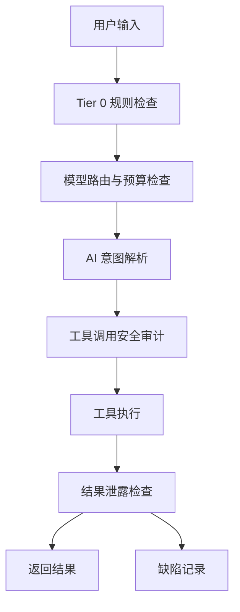

# Aegis-Agent

一个面向 **LLM / Agent 工具调用场景** 的 Python 项目，聚焦三个问题：

1. **安全**：防止提示词注入、越权工具调用和敏感信息泄露
2. **调度**：用异步方式处理多请求，避免串行阻塞
3. **验证**：通过自动化测试、对抗演练和 CI 持续验证系统行为

它不是单纯的 Web 自动化脚本集合，而是一个把 **AI 安全网关、自动化测试框架、攻防演练机制** 组合在一起的项目原型。

---

## 项目概览

Aegis-Agent 以 `AgentDispatcher` 为核心调度入口，围绕一次请求建立完整处理链路：

- 输入内容规则检查
- 模型路由与预算控制
- AI 意图解析
- 工具调用安全审计
- 工具执行
- 输出结果泄露检查
- 缺陷记录与日志追踪

同时，仓库中还包含了基于若依系统的 Web 业务链路测试，用于验证自动化测试框架在传统业务系统中的落地方式。

---

## 核心能力

### 1. 多层安全防护
- 在请求进入执行链路前进行规则拦截
- 覆盖命令注入、SQL 注入、XSS、敏感信息泄露等典型风险
- 对工具调用增加语义级审计，降低 Prompt Injection 与越权调用风险
- 对工具执行结果进行二次检查，避免敏感信息回显

核心实现：`ai_core/agents.py`

### 2. 异步调度与超时控制
- 基于 `asyncio` 组织请求处理流程
- 支持并发请求压测，验证异步执行能力
- 通过超时控制避免 AI 推理或工具执行长时间阻塞

相关实现：`ai_core/agents.py`、`tests/test_agents/test_async.py`

### 3. 智能路由与资源控制
- 根据任务复杂度选择不同处理路径
- 维护 Token 使用账本
- 在预算超限时触发熔断，保护系统稳定性

相关实现：`ai_core/router.py`

### 4. 红蓝对抗演练
- 红队 Agent 生成攻击载荷
- 蓝队调度器执行拦截和审计
- 支持多轮对抗与反馈更新
- 对成功击穿的场景自动记录缺陷

相关实现：`ai_core/arena.py`、`ai_core/attacker.py`、`ai_core/defect_manager.py`

### 5. 自动化测试与报告
- 基于 `Pytest` 组织测试
- 使用 `Allure` 生成测试报告
- 支持常规回归测试与真实 AI 演练分流
- 已接入 GitHub Actions 持续执行测试

相关实现：`run.py`、`pytest.ini`、`.github/workflows/ci.yml`

---

## 技术栈

- **语言**：Python
- **异步框架**：Asyncio
- **AI 模型**：智谱 AI GLM-4
- **测试框架**：Pytest、pytest-asyncio、Allure
- **网络请求**：requests、httpx
- **数据与配置**：PyYAML、python-dotenv
- **存储组件**：MySQL、Redis
- **CI**：GitHub Actions

---

## 仓库结构

```text
.
├── ai_core/                 # AI 网关核心：调度、路由、对抗、缺陷记录
│   ├── agents.py
│   ├── arena.py
│   ├── attacker.py
│   ├── defect_manager.py
│   └── router.py
├── api/                     # 业务接口封装
│   ├── auth_api.py
│   ├── base_api.py
│   └── user_api.py
├── common/                  # 通用组件：日志、Redis、MySQL、加解密、文件工具
├── config/                  # 环境配置与日志配置
├── data/                    # 测试数据
├── tests/
│   ├── test_agents/         # AI 网关核心测试
│   └── test_web/            # 若依业务链路测试
├── reports/                 # Allure 原始结果与报告产物
├── run.py                   # 测试运行入口
├── pytest.ini               # Pytest 配置
└── requirements.txt         # 依赖列表
```

---

## 处理链路



---

## 测试设计

### 测试分层

- **网关逻辑测试**：验证路由、审计、拦截和异常处理
- **并发测试**：验证异步调度是否具备并发执行效果
- **攻防演练测试**：验证红蓝对抗与缺陷记录闭环
- **Web 集成测试**：验证若依系统登录、用户管理等业务链路

### 测试目录定位

- `tests/test_agents/`：作品集的核心展示内容，适合优先阅读和运行
- `tests/test_web/`：传统业务系统集成验证能力的补充，需要更多本地环境依赖
- 两类测试不是并列主线，而是“核心能力 + 集成落地”的关系

### Marker 约定

项目在 `pytest.ini` 中定义了以下测试标记：

- `smoke`：冒烟测试
- `p0`：核心链路测试
- `p1`：异常边界测试
- `db`：依赖数据库断言的测试
- `real_ai`：调用真实 AI 的演练测试

### 已覆盖的代表场景

- 并发请求调度验证：`tests/test_agents/test_async.py`
- 网关逻辑与安全拦截：`tests/test_agents/test_gateway_logic.py`
- 红蓝对抗与缺陷记录：`tests/test_agents/test_arena.py`
- 若依登录与用户管理：`tests/test_web/`

---

## 快速开始

### 1. 安装依赖

```bash
pip install -r requirements.txt
```

### 2. 配置环境变量

在项目根目录创建 `.env` 文件：

```bash
ZHIPU_API_KEY=your_api_key_here
```

如果需要运行本地业务链路测试，还需根据实际环境补充若依系统、Redis、MySQL 相关配置。

### 3. 最小可运行路径

如果你是第一次查看这个项目，建议按下面顺序快速验证：

```bash
# 1) 安装依赖
pip install -r requirements.txt

# 2) 先运行核心测试，避免依赖真实 AI 和外部业务环境
pytest tests/test_agents/ -v -m "not real_ai"
```

这个路径最适合招聘方或面试官快速理解项目的核心能力：
- 异步调度
- 安全拦截
- 攻防演练
- 缺陷闭环

如果要继续体验：
- `tests/test_web/` 需要本地业务环境支持
- `real_ai` 测试会调用真实模型并消耗 API 额度

---

## 运行方式

### 方式 1：使用交互式运行器

```bash
python run.py
```

可选择：
- 常规回归测试（Mock 模式）
- 真实 AI 演练测试
- 全量测试

### 方式 2：直接运行 Pytest

```bash
# 排除真实 AI，用于日常回归
pytest -m "not real_ai"

# 只运行真实 AI 演练
pytest -m "real_ai"

# 运行全部测试
pytest
```

### 方式 3：生成 Allure 报告

```bash
allure generate ./reports/allure_raw -o ./reports/allure_report --clean
```

### 本地生成文件说明

以下内容属于运行或测试过程中的**本地生成产物**，不会作为作品集仓库内容维护：

- `.env`：本地环境变量配置
- `reports/`：Allure 原始结果与 HTML 报告
- `tests/test_web/reports/`：Web 测试阶段产生的报告数据
- `logs/`：运行日志
- `logs/security_defects.jsonl`：缺陷记录输出
- `.pytest_cache/`、`__pycache__/`：缓存文件

如果你克隆仓库后运行测试，这些目录或文件可能会自动生成，这是正常现象。

---

## CI 说明

仓库已配置 GitHub Actions：

- 触发时机：`push`
- 执行环境：`ubuntu-latest`
- Python 版本：`3.10`
- 执行命令：`python run.py`

配置文件：`.github/workflows/ci.yml`

---

## 项目适合展示的能力点

如果你把这个仓库作为作品集项目，它更适合体现以下能力：

- **Python 工程能力**：模块拆分、配置管理、日志追踪、异常处理
- **测试开发能力**：Pytest 分层、Mock/真实环境分流、报告生成、CI 集成
- **异步编程能力**：基于 Asyncio 的并发调度与超时控制
- **AI 应用安全意识**：工具调用审计、Prompt Injection 防护、结果泄露检查
- **问题闭环能力**：从攻击模拟、拦截、记录到缺陷落盘

---

## 可补充的展示素材

如果要继续把这个仓库打磨成更完整的作品集，可以补充：

- 架构图截图：展示调度、审计、执行与缺陷记录关系
- Allure 报告截图：展示测试结果与分类
- CI 成功截图：展示自动化执行结果
- 关键测试用例截图：展示异步压测或安全拦截场景

---

## 后续可继续完善的方向

- 增加覆盖率统计与质量门禁
- 输出更直观的架构图与测试结果截图
- 丰富更多攻击样本与防御规则
- 补充真实环境下的性能数据与基准对比
- 将缺陷记录对接到真实缺陷管理平台

---

## 说明

本项目适合作为以下方向的作品集或项目经历：

- 测试开发 / 自动化测试 / SDET
- Python 后端开发
- AI 应用工程
- AI 安全与 LLM Guardrail 相关岗位
